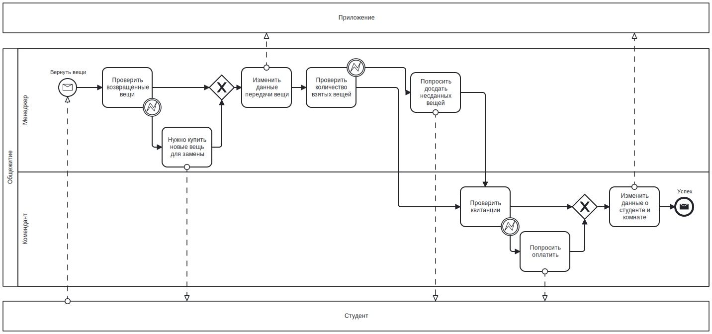
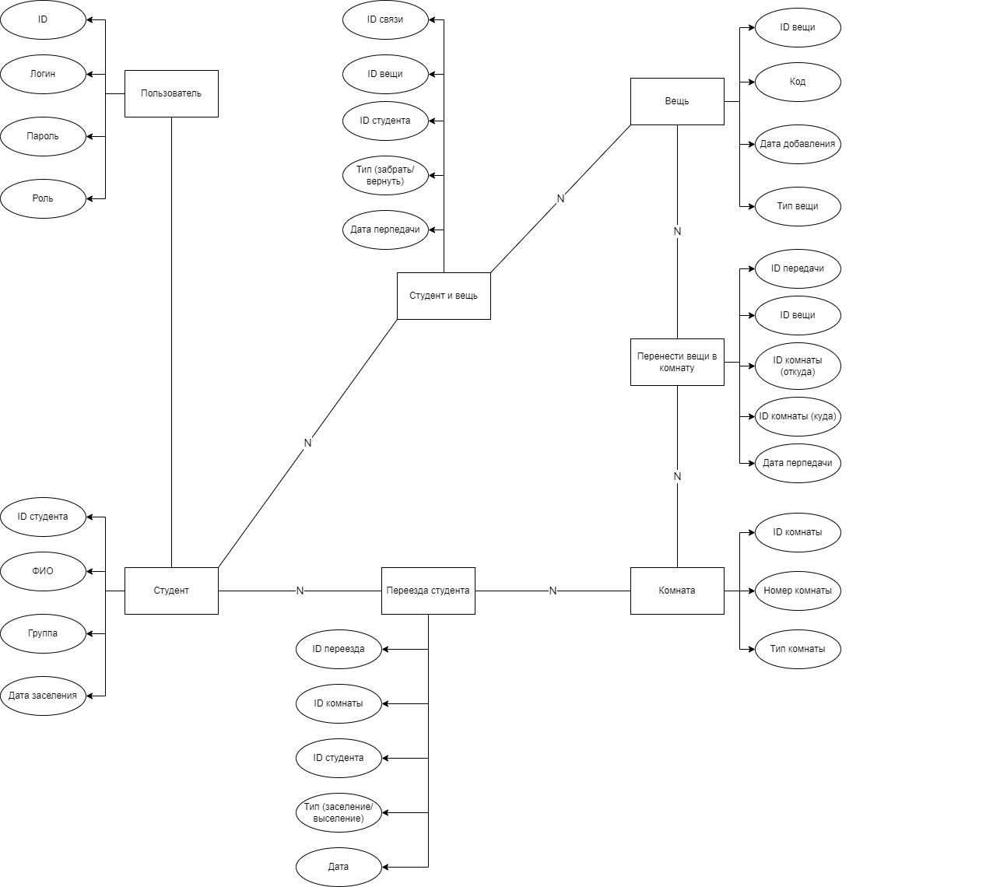
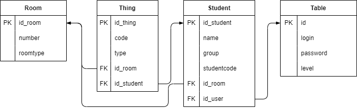
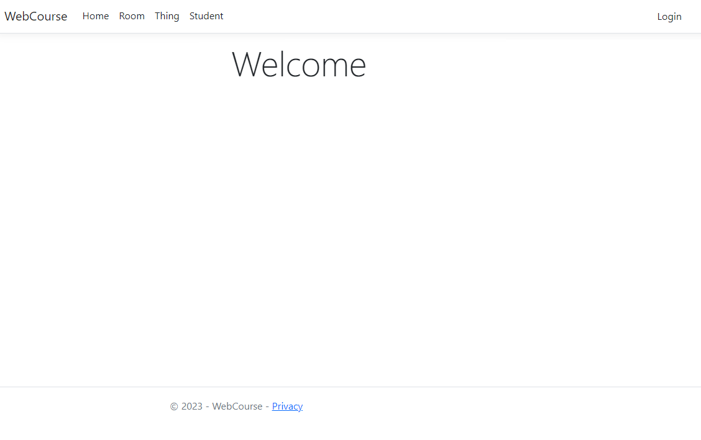
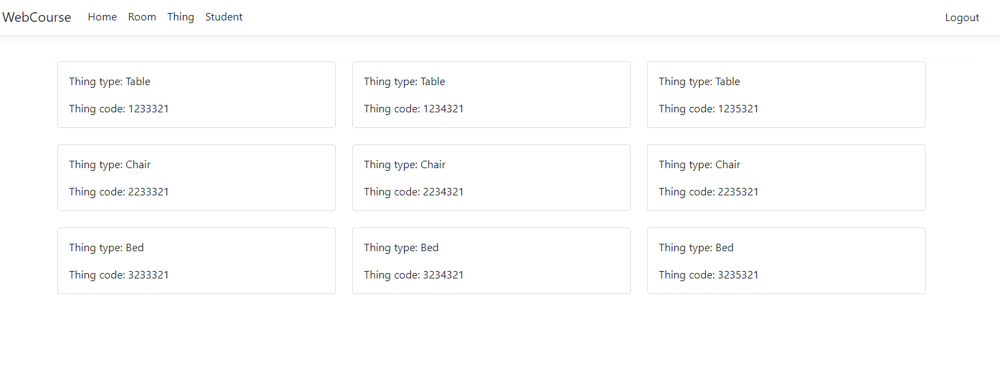
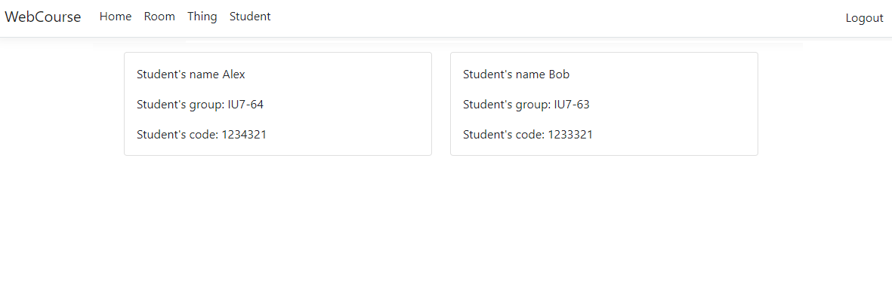
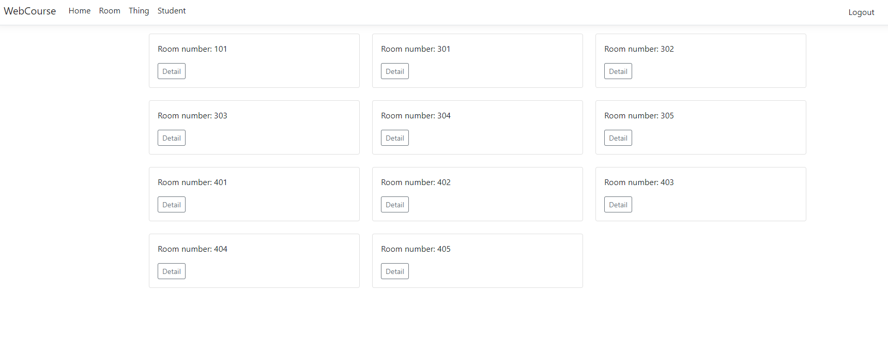

# Основы Разработки WEB-приложений

## 1. Цель работы
Целью данной работы является разработка Web-приложения, позволяющего управлять комнатами и вещами общежития.

## 2. Функциональные требования
* Вход в систему / выход из системы
* Отображение списка всех комнат
* Отображение списка всех вещей
* Отображение списка свободных вещей
* Отображение списка всех студентов
* Добавить / изменить / удалить комнату
* Добавить / изменить / удалить вещь
* Добавить / изменить / удалить студент

## 3. Use-Case - диаграмма

## 4. BPMN диаграмма основных бизнес-процессов

## 5. Пользовательские сценарии
`Студент` имеет возможность посмотреть список cвоих взятых вещей, список студентов.

`Комендант` имеет возможность добавить/изменить/удалить данные студента, посмотреть список студентов, список всех вещей в общежитии.

`Менеджер` имеет возможность выдать/заменить/забрать вещь, добавить новую вещь, посмотреть список студентов, список всех вещей в общежитии.

### Сценарий:
1. Новый студент заселяется в общежитие. В базу данных добавляются информации о студенте и информации об вещах, выдаваемых студентам.
2. Студент хочет обменять на новую вещь. После принятия изменяются информации об вещах, выдаваемых студентам.
3. Студент хочет вернуть вещи в общежитие. После того, что менеджер забирает вещи у студента, изменяются/удаляются информации об вещах, выдаваемых студентам.
4. Студент выселяется. После подтверждения того, что студент вернул все вещи в общежитие, информация о студенте удаляется из базы данных.

## 6. ER-диаграмма сущностей

## 7. Диаграмма БД

## 8. Черновые эскизы

