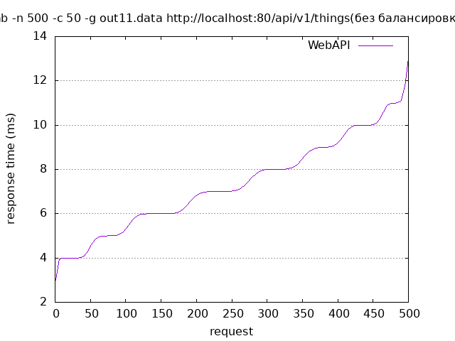
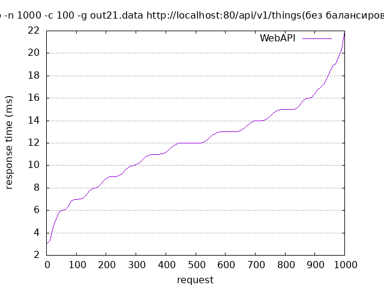
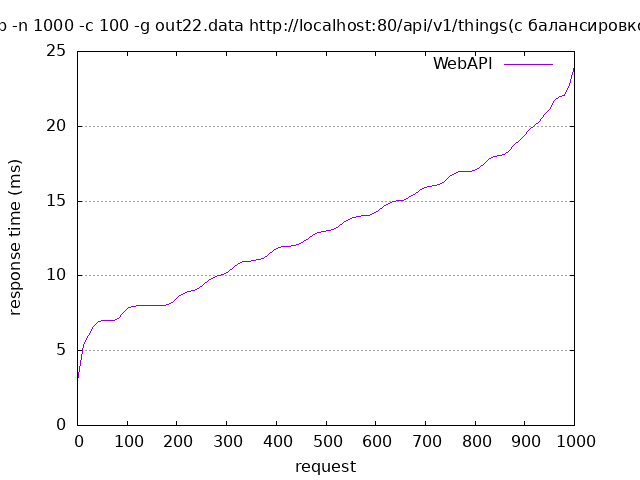

# Нагрузочное тестирование
Command for create image: 
```shell
gnuplot abc.p
```
Для проведения нагрузочного тестирования веб сервера использовался Apache Benchmark.

Было проведено 2 теста с разным общим количеством запросов и с разным количеством параллельных запросов.

## Тест 1

#### Команда
```shell
ab -n 500 -c 50 -g out.data http://localhost:80/api/v1/Things
```

### Результаты без балансировки

```
Server Software:        WebAPI
Server Hostname:        localhost
Server Port:            80

Document Path:          /api/v1/Things
Document Length:        670 bytes

Concurrency Level:      50
Time taken for tests:   0.080 seconds
Complete requests:      500
Failed requests:        0
Total transferred:      404000 bytes
HTML transferred:       335000 bytes
Requests per second:    6253.83 [#/sec] (mean)
Time per request:       7.995 [ms] (mean)
Time per request:       0.160 [ms] (mean, across all concurrent requests)
Transfer rate:          4934.66 [Kbytes/sec] received

Connection Times (ms)
              min  mean[+/-sd] median   max
Connect:        0    0   0.5      0       2
Processing:     3    7   2.1      7      12
Waiting:        1    7   2.1      6      12
Total:          3    7   2.0      7      13
```



### Результаты с балансировкой

```
Server Software:        WebAPI
Server Hostname:        localhost
Server Port:            80

Document Path:          /api/v1/Things
Document Length:        670 bytes

Concurrency Level:      50
Time taken for tests:   0.071 seconds
Complete requests:      500
Failed requests:        0
Total transferred:      404000 bytes
HTML transferred:       335000 bytes
Requests per second:    7090.09 [#/sec] (mean)
Time per request:       7.052 [ms] (mean)
Time per request:       0.141 [ms] (mean, across all concurrent requests)
Transfer rate:          5594.52 [Kbytes/sec] received

Connection Times (ms)
              min  mean[+/-sd] median   max
Connect:        0    0   0.3      0       1
Processing:     2    6   2.0      6      15
Waiting:        1    6   2.0      6      15
Total:          2    7   1.9      7      15
```


## Тест 2

#### Команда
```shell
ab -n 1000 -c 100 -g out.data http://localhost:80/api/v1/Things
```

### Результаты без балансировки

```
Server Software:        WebAPI
Server Hostname:        localhost
Server Port:            80

Document Path:          /api/v1/Things
Document Length:        670 bytes

Concurrency Level:      100
Time taken for tests:   0.129 seconds
Complete requests:      1000
Failed requests:        0
Total transferred:      808000 bytes
HTML transferred:       670000 bytes
Requests per second:    7109.41 [#/sec] (mean)
Time per request:       12.859 [ms] (mean)
Time per request:       0.129 [ms] (mean, across all concurrent requests)
Transfer rate:          6136.08 [Kbytes/sec] received

Connection Times (ms)
              min  mean[+/-sd] median   max
Connect:        0    1   0.6      0       2
Processing:     1   11   3.9     12      21
Waiting:        1   11   3.8     11      21
Total:          3   12   3.6     12      22
```

### Результаты с балансировкой

```
Server Software:        WebAPI
Server Hostname:        localhost
Server Port:            80

Document Path:          /api/v1/Things
Document Length:        670 bytes

Concurrency Level:      100
Time taken for tests:   0.141 seconds
Complete requests:      1000
Failed requests:        0
Total transferred:      808000 bytes
HTML transferred:       670000 bytes
Requests per second:    7776.80 [#/sec] (mean)
Time per request:       14.065 [ms] (mean)
Time per request:       0.141 [ms] (mean, across all concurrent requests)
Transfer rate:          5610.07 [Kbytes/sec] received

Connection Times (ms)
              min  mean[+/-sd] median   max
Connect:        0    1   0.7      1       3
Processing:     3   12   4.6     12      22
Waiting:        1   12   4.5     12      22
Total:          3   13   4.4     13      24
```
