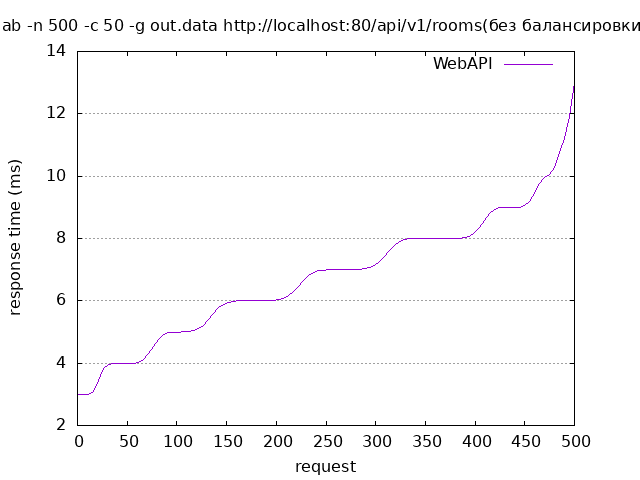
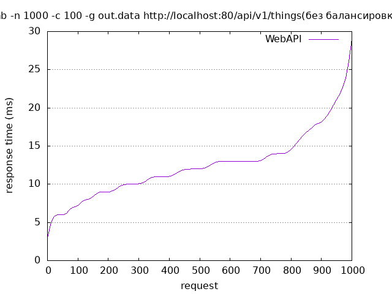
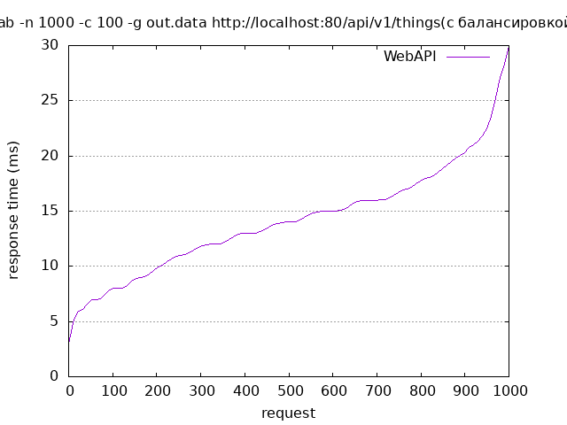

# Нагрузочное тестирование
Command for create image: 
```shell
gnuplot bench_balance.p
```
Для проведения нагрузочного тестирования веб-веб сервера использовался Apache Benchmark.

Было проведено три теста с разным общим количеством запросов и с разным количеством параллельных запросов.

## Тест 1

#### Команда
```shell
ab -n 500 -c 50 -g out.data http://localhost:80/api/v1/rooms
```

### Результаты без балансировки

```
Server Software:        nginx/1.25.3
Server Hostname:        localhost
Server Port:            80

Document Path:          /api/v1/Rooms
Document Length:        443 bytes

Concurrency Level:      50
Time taken for tests:   0.072 seconds
Complete requests:      500
Failed requests:        0
Total transferred:      293500 bytes
HTML transferred:       221500 bytes
Requests per second:    6911.81 [#/sec] (mean)
Time per request:       7.234 [ms] (mean)
Time per request:       0.145 [ms] (mean, across all concurrent requests)
Transfer rate:          3962.14 [Kbytes/sec] received

Connection Times (ms)
              min  mean[+/-sd] median   max
Connect:        0    0   0.2      0       1
Processing:     2    7   2.0      6      13
Waiting:        1    6   2.0      6      13
Total:          3    7   2.0      7      13
```



### Результаты с балансировкой

```
Server Software:        nginx/1.25.3
Server Hostname:        localhost
Server Port:            80

Document Path:          /api/v1/Rooms
Document Length:        443 bytes

Concurrency Level:      50
Time taken for tests:   0.093 seconds
Complete requests:      500
Failed requests:        0
Total transferred:      293500 bytes
HTML transferred:       221500 bytes
Requests per second:    5349.60 [#/sec] (mean)
Time per request:       9.347 [ms] (mean)
Time per request:       0.187 [ms] (mean, across all concurrent requests)
Transfer rate:          3066.61 [Kbytes/sec] received

Connection Times (ms)
              min  mean[+/-sd] median   max
Connect:        0    1   0.5      0       2
Processing:     2    7   2.5      7      15
Waiting:        2    7   2.4      7      15
Total:          3    8   2.5      8      16
```


## Тест 2

#### Команда
```shell
ab -n 1000 -c 100 -g out.data http://localhost:80/api/v1/rooms
```

### Результаты без балансировки

```
Server Software:        nginx/1.25.3
Server Hostname:        localhost
Server Port:            80

Document Path:          /api/v1/Things
Document Length:        670 bytes

Concurrency Level:      100
Time taken for tests:   0.131 seconds
Complete requests:      1000
Failed requests:        0
Total transferred:      814000 bytes
HTML transferred:       670000 bytes
Requests per second:    7648.83 [#/sec] (mean)
Time per request:       13.074 [ms] (mean)
Time per request:       0.131 [ms] (mean, across all concurrent requests)
Transfer rate:          6080.22 [Kbytes/sec] received

Connection Times (ms)
              min  mean[+/-sd] median   max
Connect:        0    1   0.8      1       4
Processing:     3   12   4.5     11      28
Waiting:        1   11   4.5     11      28
Total:          3   12   4.3     12      29
```

### Результаты с балансировкой

```
Server Software:        nginx/1.25.3
Server Hostname:        localhost
Server Port:            80

Document Path:          /api/v1/Things
Document Length:        670 bytes

Concurrency Level:      100
Time taken for tests:   0.155 seconds
Complete requests:      1000
Failed requests:        0
Total transferred:      814000 bytes
HTML transferred:       670000 bytes
Requests per second:    6452.74 [#/sec] (mean)
Time per request:       15.497 [ms] (mean)
Time per request:       0.155 [ms] (mean, across all concurrent requests)
Transfer rate:          5129.42 [Kbytes/sec] received

Connection Times (ms)
              min  mean[+/-sd] median   max
Connect:        0    1   0.9      1       3
Processing:     2   13   5.0     13      29
Waiting:        1   12   4.9     12      27
Total:          3   14   4.9     14      30
```
